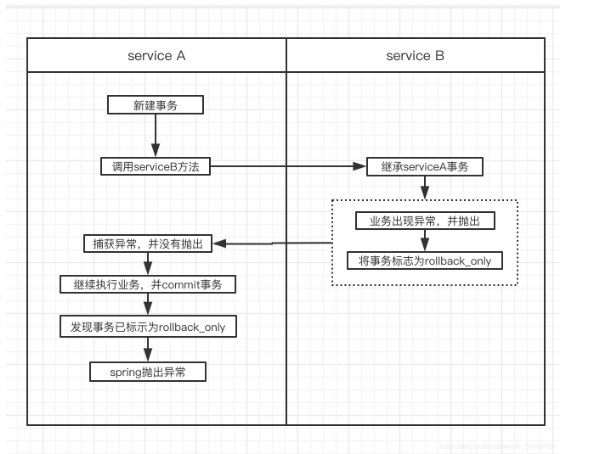

&ensp;&ensp;&ensp;&ensp;spring基于代理的事务分为以下几个类别：
- required，支持当前事务如果没有再创建一个
- supports:支持当前事务，如果没有，就不使用事务
- mandatory:强制使用当前事务，如果不存在抛异常
- requires_new：必须创建一个新的，如果有了挂起
- not_supported:不支持，如果有事务，把事务挂起
- never:如果有事务，抛异常
- nested:嵌套，如果当前有了，执行嵌套，如果当前没有创建一个新的
通常情况下我们在一个方法体上加上@Transcational这个注解，就能实现事务，但是其实有一些注意点


### 实务跨类才能生效
&ensp;&ensp;&ensp;&ensp;我们知道spring的事务是基于代理模式实现的，但是所谓代理模式都是为某一个类生成一个代理类，然后在代理类中为原本的某个方法进行切面增强，所以代理是作用在类上的，故而spring的事务也是需要跨类调用才会生效的，比如：
```java
class A{

    public void fun1(){
        fun2()
    }

    @Transcational
    public void fun2(){

    }
}

class B{

    @AutoWired
    private A a;

    public void fun3(){
        a.fun2()
    }
}
```
其中在fun1()中调用fun2()方法时，fun2的事务是不生效的,但是在B类中的fun3()调用fun2()时事务是生效的。


### required事务嵌套异常
&ensp;&ensp;&ensp;&ensp;上面有写required的传播是如果当前在事务中就直接使用已经有的事务，但是如果内部事务抛出了一个异常，然后在外部事务中捕获了就会造成外部事务无法提交:
```java
class A{

    @Transcational
    public void fun1(){
        int a = 1/0;
    }
}

class B{

    @AutoWired
    A a;

    @Transcational
    public void fun2(){
        try{
            a.fun1()
        }catch(Exception e){
            e.printStack()
        }

        //其他内容
        ……………………     
    }
    
}
```
上面的B类中对A类的fun1的异常进行了catch，但是B的事务还是会被回滚掉,如下图

当ServiceA执行完自身全部业务，准备commit事务时，检查发现事务已被标志为rollback。则不予commit，并且抛出异常：“Transaction rolled back because it has been marked as rollback-only”