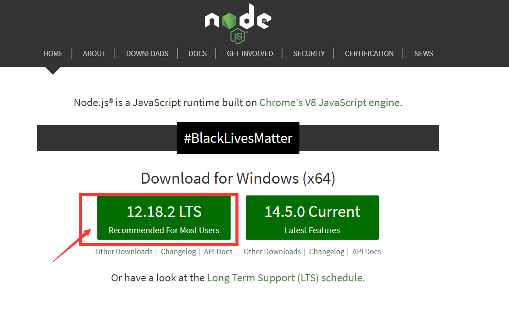

### 安装nodejs
 安装nodejs，下载地址（https://nodejs.org/en/）

查看nodejs和npm是否安装好
```cmd
E:\Soft\Node\node_global>node -v
v12.18.2

E:\Soft\Node\node_global>npm -v
6.14.5
```

### 安装apidoc
```cmd
npm install apidoc -g
```
安装之后进入node的node_global目录如下图说明安装完成


### 生成kotlin的在线接口文档
1. 增加apidoc.json文件到项目根目录下：
```json
{
  "name": "xxx接口文档",
  "version": "1.0.0",
  "description": "xxx接口文档", 
  "title": "xxx接口文档",
  "url" : "http://localhost:8080/api-ebike"
}
```
2. 在apidoc所在的目录下执行生成命令
```cmd
apidoc -f ".kt" -i E:\Data\KotlinWorkspace\apidoc-test -o E:\Data\KotlinWorkspace\apidoc-test\src\main\resources\static
```
需要注意的是把生成后的js和html都放到static目录下，这样就可以随着项目进行访问了。

效果图：
