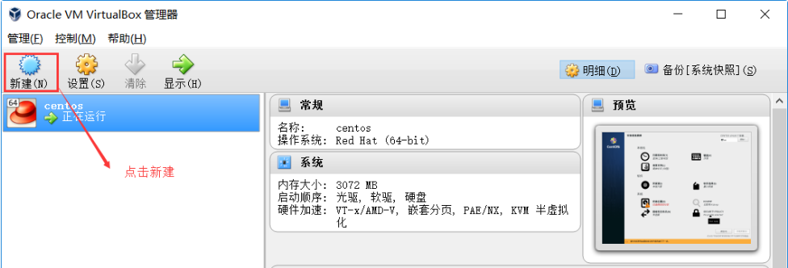
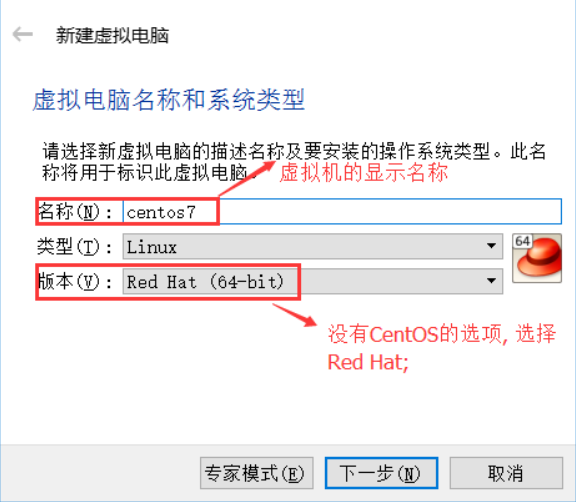
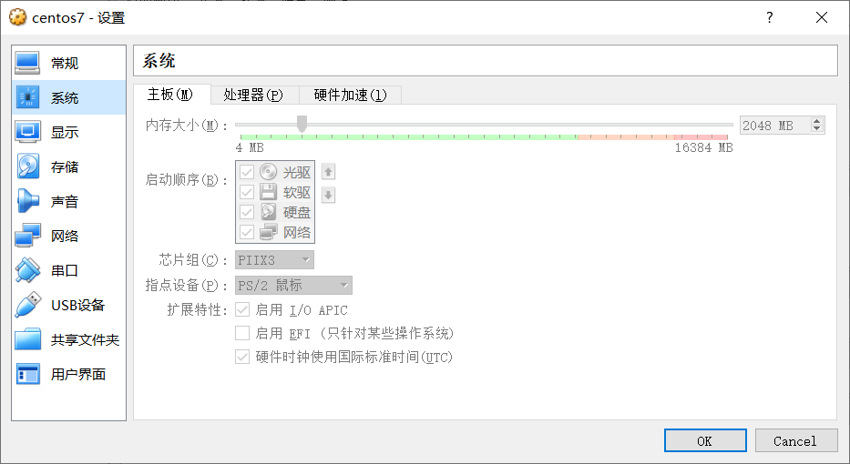
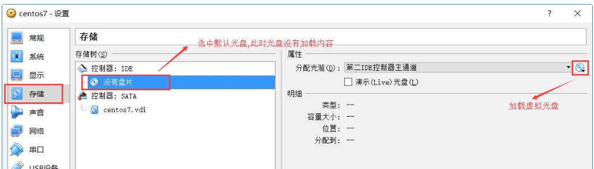
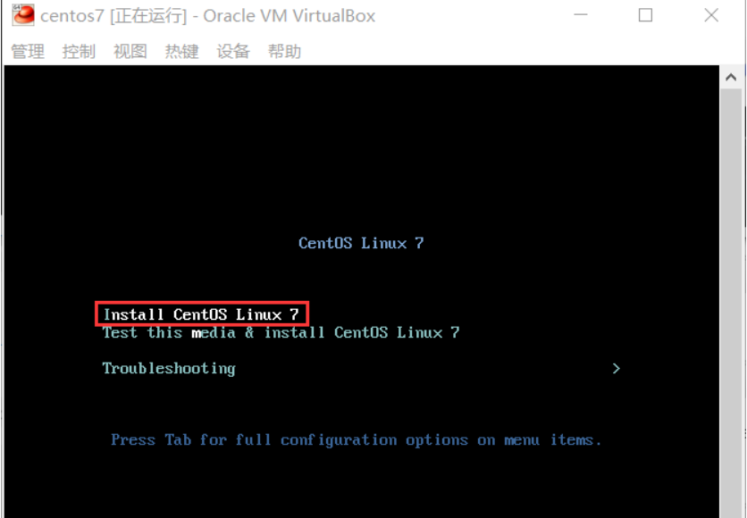

### 安装virtualbox（也可以安装vmware）
&ensp;&ensp;&ensp;&ensp;由于virtualbox是开源免费的，直接百度下载下来就好了。一路next安装，注意下路径就好了。

### 下载centos镜像
&ensp;&ensp;&ensp;&ensp;可以从官网上下载，速度肯定慢，然后可以从国内的一些仓库下载,比如阿里云的：http://mirrors.aliyun.com/centos/7/isos/x86_64/，  自己试了一下感觉还是很慢。所以这里提供一下我百度云盘上的链接：
```
链接: https://pan.baidu.com/s/1lPYxW0029J8I46jUZwdO_A 
提取码: 3x97 
```


### 安装centos虚拟机
1. 新建


2. 选择虚拟机类型,然后依次选择内存大小，创建虚拟硬盘（硬盘格式为VDI）,固定大小，然后选择大小和存储路径（存储路径不能漏了，一般都会设置的几十个G，如果默认放在C盘，就有点难受了），最后开始创建虚拟机，登上上一段时间。



3. 配置启动优先级和镜像路径
选择主界面的设置选项，然后进入系统配置界面,配置启动优先级：

再进入存储界面配置一开始下载的镜像：



### 启动虚拟机
&ensp;&ensp;&ensp;&ensp;首次启动会进行安装，虚拟机启动之后，选择安装linux。

然后选择中文语言，之后顺着提示一路next，就能安装好了。


### 配置网络
&ensp;&ensp;&ensp;&ensp;按照如上流程完成安装之后，会发现使用yum进行操作时，会报一个：Cannot find a valid baseurl for repo: base/7/x86_6。这样的错误，然后用ping去ping百度，发现也是不通的，显然网络有问题。解决方法如下：
1. 打开 vi /etc/sysconfig/network-scripts/ifcfg-eth0（每个机子都可能不一样，但格式会是“ifcfg-eth数字”），把ONBOOT=no，改为ONBOOT=yes
2. 如果需要配置固定ip请看这一步，否则直接到第3步。配置固定ip需要对步骤1中的文件内容做如下修改：
```
#BOOTPROTO=dhcp 将动态分配ip地址注释
BOOTPROTO=static 使用静态ip地址
IPADDR=192.168.1.117 ip地址
NETMASK=255.255.255.0 子网掩码
GATEWAY=192.168.1.1 网关
DNS1=114.114.114.114
```
注意点：其中子网掩码和网关都是宿主机器的子网掩码和网关。而ip地址和网关只有最有一位是不一样的，比如上面的ip和网关，只有117和1的区别，前面的192.168.1都是一样的，最重要的是DNS1这一项，我一开始没配，造成我一直无法正常使用，至于为啥值为114.114.114.114其实我有点懵，欢迎大神指点。最后，还需要在irtualbox中配置桥连模式，详见《ssh远程无法访问linux解决方案》
3. 重启网络：service network restart
