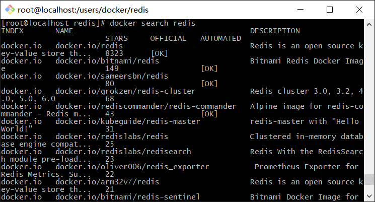
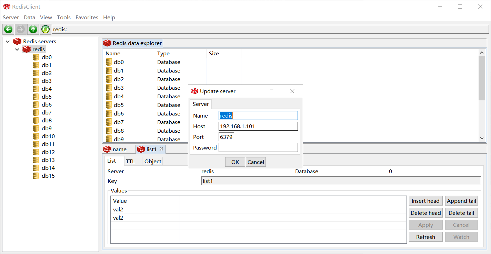
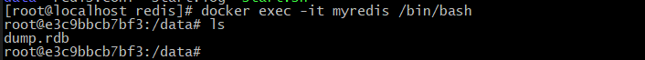
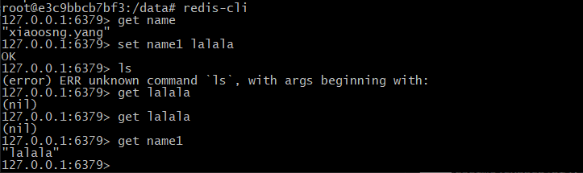

### docker安装和启动redis
&ensp;&ensp;&ensp;&ensp;linux上利用docker进行安装redis，首先利用docker搜索命令：docker search redis，看看有哪些redis镜像

然后通过docker pull docker.io$/$redis 命令将镜像拉下来。在通过run命令生成容器和启动容器：docker run -p 6379:6379 -idt --name myredis docker.io$/$redis。其中-p 6379:6379意思是将宿主机器的6379端口映射到容器的6379端口。这样外部客户端直接通过连接宿主机器的6379端口，就可以和redis进行通讯了。

### redis可视化客户端
&ensp;&ensp;&ensp;&ensp;启动redis服务之后我们可以通过redis的可视化客户端尝试进行连接redis服务。客户端下载地址：
https://github.com/caoxinyu/RedisClient/tree/windows/release
下载之后我们尝试进行连接

图中可以看到没有输入密码，实际上通过上线那种简单的docker安装和启动redis是不需要密码的，只要端口和ip正确就可以直接连接。

### docker的redis客户端
&ensp;&ensp;&ensp;&ensp;我们知道我们可以通过docker exec命令进入到docker的容器内部，docker安装的redis也不例外。我们通过命令：docker exec -it myredis /bin/bash即可进入到redis的容器中。

在redis的容器中，我们通过lis命令可以看到一个dump.rdb，我们知道这是redis的持久化文件。进入到redis容器中，我们可以通过redis-cli命令进入redis客户端进行redis的相关命令操作

