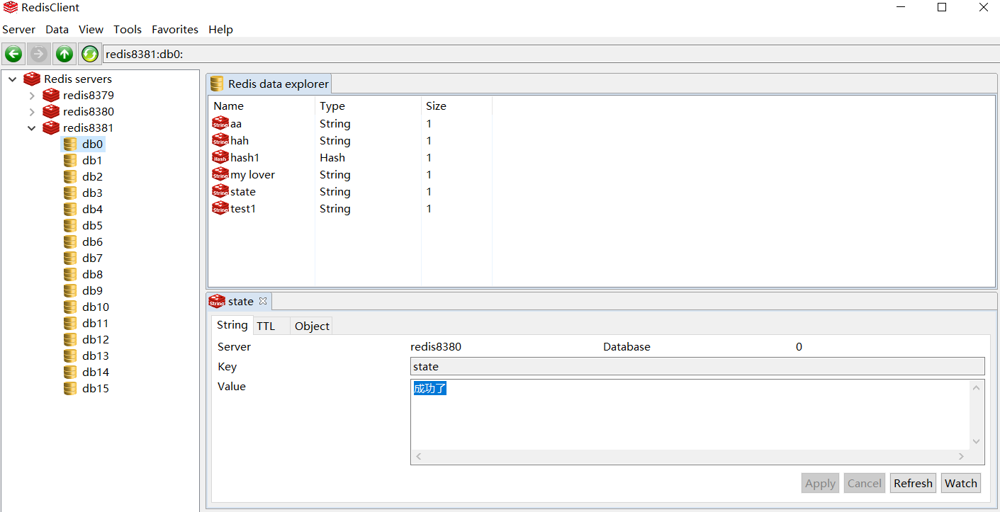

&ensp;&ensp;&ensp;&ensp;为了实现基于docker容器化的redis集群搭建，我们首先要知道如何通过docker以配置文件的形式启动一个redis容器（服务）。相对而言的就是启动一个默认配置的redis容器，这个在《docker安装redis和基本使用》一文中已经讲过了。
&ensp;&ensp;&ensp;&ensp;redis的配置文件叫redis.conf文件，我们可以从官网上下载一个样本来改，下载方法：
```shell
wget http://download.redis.io/redis-stable/redis.conf
```
这样这个模板配置文件redis.conf就被下载到我们的当前目录了。我们首先需要对这个文件做最基本的配置修改：
```
#bind 127.0.0.1        #如果bind选项为空的话，则允许所有来自于可用网络接口的连接
protected-mode no      #保护模式，若为yes，只允许本地客户端连接
appendonly yes         #开启后，Redis会把每次写入的数据在接收后都写入 appendonly.aof 文件，每次启动时Redis都会先把这个文件的数据读入内存里
```
然后将这个配置文件放到我们指定的目录，我们这里打算搭建一个一主两备的集群，建了三个文件夹redis8379，redis8390，redis8381，其中8379位主，我们将上面的配置文件拷贝到8379的目录下，然后执行下面的命令。
```shell
# --name redis8379容器别名
# --privileged=true 给容器设置特殊权限
# -p 8379:6379 端口映射 宿主端口8379,容器端口6379
# -v /users/docker/redis/redis8379:/data 路径映射，宿主磁盘路径/users/docker/redis/redis8379，对应容器路径
# -d 后台起应用
# docker.io/redis 镜像名字
# /data/redis.conf 以配置文件形式启动，这是容器里的配置文件路径
docker run  --name redis8379 --privileged=true  -p 8379:6379 -v /users/docker/redis/redis8379:/data -d docker.io/redis  /data/redis.conf
```
执行完命令之后redis主节点就启动了。其中--privileged=true这项命令可能会觉得疑惑，原因是如果以容器启动，容器是不具备映射路径的权限的，需要另外配置，这里通过--privileged=true简化了配置，直接赋予特殊权限。

&ensp;&ensp;&ensp;&ensp;从服务器同样也通过配置脚本模式启动，我们将之前主节点下的redis.conf文件拷贝到两个从节点目录，然后在文件中再加一句配置：
```shell
replicaof 192.168.1.117 8379
```
指明主服务器的ip和端口，这里的ip和端口都是宿主机器维度的，然后我们执行docker容器启动命令：
从服务器启动命令
```shell
docker run  --name redis8380 --privileged=true  -p 8380:6379 -v /users/docker/redis/redis8380:/data -d docker.io/redis  /data/redis.conf
docker run  --name redis8381 --privileged=true  -p 8381:6379 -v /users/docker/redis/redis8381:/data -d docker.io/redis  /data/redis.conf
```
这样一主两备的集群就搭好了。我们可以通过如下命令查看每个节点的状态：
```shell
docker exec -it redis8380 redis-cli info replication
```
&ensp;&ensp;&ensp;&ensp;在搭建过程中发现了一个问题，就是从服务器一开始同步到主节点的数据，感觉很懵逼，于是我们通过日志进行查看，如果没有刻意配置容器的日志路径，我们可以通过docker的命令查看容器运行日志。我们查看了redis8380这个节点的日志，命令如下:
```shell
# -t 表示显示docker的时间戳，还有一些其他的附加指令，可以百度。
docker logs -t redis8380
```
然后发现日志一直是这样的：
```shell

4212:S 16 Jun 2020 10:03:52.904 * MASTER <-> REPLICA sync started
4212:S 16 Jun 2020 10:03:52.904 # Error condition on socket for SYNC: Operation now in progress
4212:S 16 Jun 2020 10:03:53.916 * Connecting to MASTER 127.0.0.1:7001
```
中间有一行错误Error condition on socket for SYNC: Operation now in progress。应该就是没有复制成功的原因了，但是百度之后发现找不到答案，全都是关于连不上的，说的最多的大概是三种：
1. redis.conf中配置了bind 127.0.0.1，注释掉就好了。或者使用bind 0.0.0.0
2. 端口冲突，这个查端口杀进程，或者换个端口大家应该都会的。
3. 主节点设置了密码，从节点需要在redis.conf中指定主节点的密码，并且从节点也要设置密码，一般的做法事主节点不设置密码，从节点设置密码：
```shell
# 指定主节点密码
masterauth passwd123
# 设置从节点自己的密码
requirepass passwd123
```
但是这上面的三种都不是我的原因。最后查出来还是因为自己的防火墙问题。这里说一下我是win10系统里安装了centos7的虚拟机，再安装了docker来搭建的redis集群。所以虽然我能通过win10访问到centos，但还是出现了防火墙问题。我一开始以为自己能够通过客户端访问到redis应该就没有防火墙问题了。
&ensp;&ensp;&ensp;&ensp;在centos7中默认的防火墙软件是firewall，防火墙中分为很多个区域，可以通过firewall-cmd --get-active-zones命令查看所有区域
```shell
[root@localhost redis8381]# firewall-cmd --get-active-zones
public
  interfaces: enp0s3
```
可以看到我们默认情况下只有一个区域就是public，就是配对外可访问的区域，然后通过firewall-cmd --zone=public --list-ports查看该区域下所有可访问的端口：
```shell
[root@localhost redis8381]# firewall-cmd --zone=public --list-ports
6379/tcp 8379/tcp
```
可以看到我们这里有了8387这个主节点的端口，一开始报Error condition on socket for SYNC: Operation now in progress的时候，就是因为没有配，所以从节点容器无法访问到主节点。如果要往某个区域中加端口可以通过如下命令：
```
 firewall-cmd --zone=public --add-port=8379/tcp
```
对防火墙如果想了解更多使用方式的话可以看如下链接([《Linux firewall-cmd命令》](https://blog.csdn.net/qq_27870421/article/details/93165382))

&ensp;&ensp;&ensp;&ensp;最后看一下主从服务效果：

