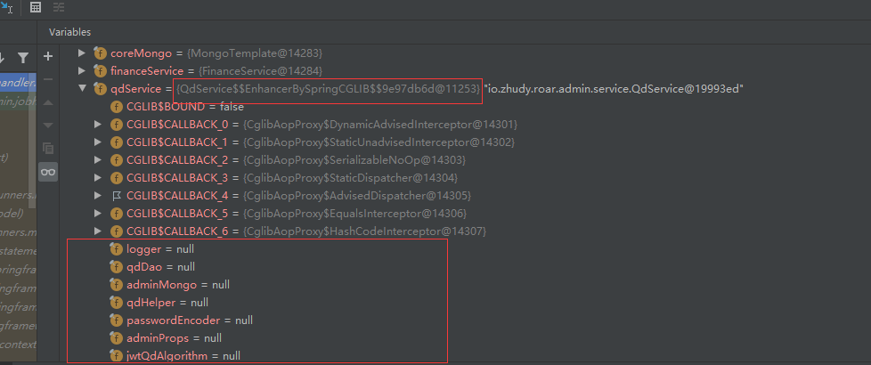

&ensp;&ensp;&ensp;&ensp;近日遇到一个很诡异的问题，kotlin的一段老代码莫名其妙报空指针，而且只有整个springboot项目起起来才会报错，如果写单元测试时单独注入几个类，是不会报错的。最终锁定原因是因为在原本的service类中，新增的一些方法我加上了@Transcational进行事务处理，这就导致生成service类的对象时会为他生成一个基于cglib创建的代理子类。而这个子类中所有的属性都是空指针:

但是为什么创建出来的对象会属性都为空呢，毕竟这这些属性都在父类的构造方法里，继承父类构建的子类也需要重写父类的构造方法，按理来说不应该空，但是如果翻了spring源码的话会发现，spring生成代理对象的时候使用了Objenesis来创建，

Objenesis是java的一个库，可以绕过构造方法以及相关的初始化来创建对象，所以生成的代理类中所有的属性全部都是空的。

```java
@Service
public class MyService {
    public String str = new String("hello world");
    
    @Transactional(rollbackFor = Throwable.class)
    public void test() {
       XXXX
    }
}

//1.工具类
Enhancer en = new Enhancer();
//2.设置父类
en.setSuperclass(MyService.class);
en.setCallbackType(MyMethodInterceptor.class);
Class proxyClass = en.createClass();
//使用cglib构造代理对象并输出str
System.out.println("cglib:"+((MyService) en.create()).str);
//使用objenesis+cglib构造代理对象
Objenesis objenesis = new ObjenesisStd(true);
Object proxyInstance = objenesis.newInstance(proxyClass);
System.out.println("cglib+objenesis:"+((MyService) proxyInstance).str); 

输出结果： 
cglib:hello world
cglib+objenesis:null 
```
所以当我们@Autowired注入了代理类，如果想当然的直接使用被注入对象的属性，则一定会报空指针，而我们正常情况为什么没有发生问题呢，原因是我们一般都是调用该对象的方法，而不是直接使用其中的属性的，而调用其中的方法，则代理类处理完切面任务之后，会进入到真正的对象，而真正的对象里的各个属性都是有值的，不会发生空指针。
&ensp;&ensp;&ensp;&ensp;而我当时遇到的问题，要比这个情况更深一步，因为用的是kotlin的内联函数，如果说该函数不是内联函数，就会像上面说的情况那样进入到真正的对象内部，那就不会有问题，而因为内联函数在编译时会把内联的代码块拷贝到被调用的地方，而被调用的地方使用的类又是代理类，涉及到其中的属性，在代理类中又都是null，从而引发了空指针。