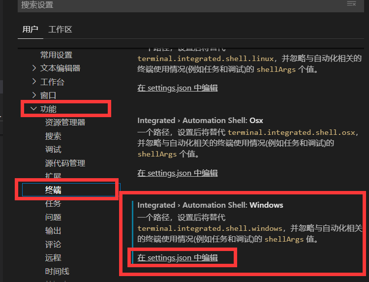

&ensp;&ensp;&ensp;&ensp;window上，vscode的终端默认是cmd，让我们习惯使用linux shell命令的人，多少有点头疼，所以这里来修改vscode的终端。
1. crtl+shift+P 进入vscode管理工具的命令行


2. 输入命令：
```shell
>Preferences:Open User Settings
```
然后进入如图界面

图中让我们配置settings.json,我们点击进入，在该json中如下配置：
```json
{
    "terminal.external.windowsExec": "E:\\Soft\\Git\\Git\\bin\\bash.exe",
    "terminal.integrated.automationShell.windows": "E:\\Soft\\Git\\Git\\bin\\bash.exe",
    "terminal.integrated.shell.windows": "E:\\Soft\\Git\\Git\\bin\\bash.exe"
}
```
把这三项配置全部换成我们安装的bashshell，然后再重新打开git的终端，就会发现从cmd变成了我们的gitbash了。